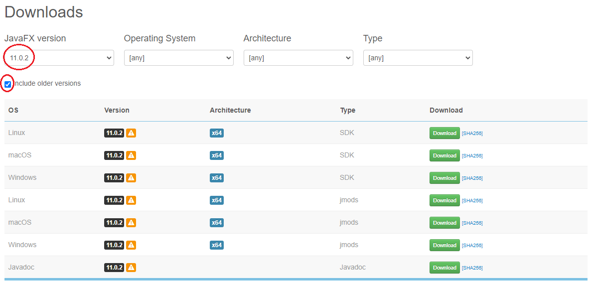
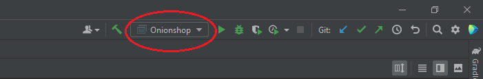
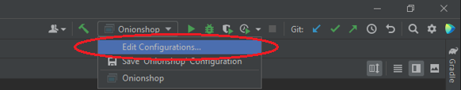
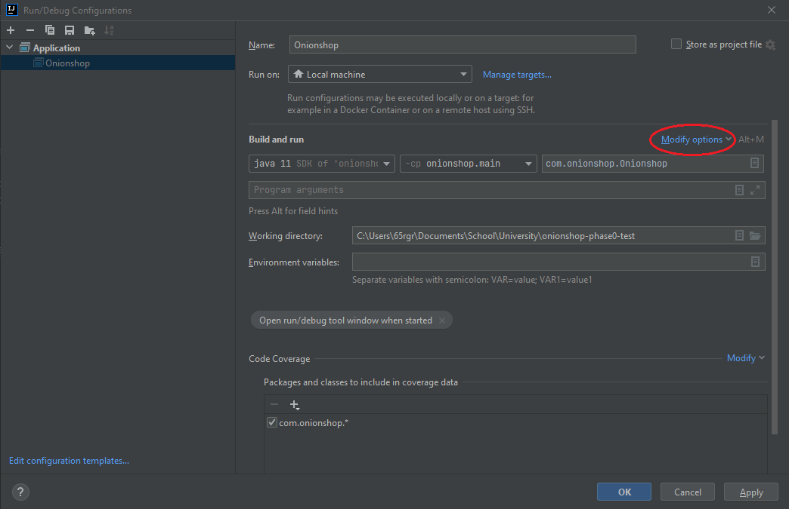
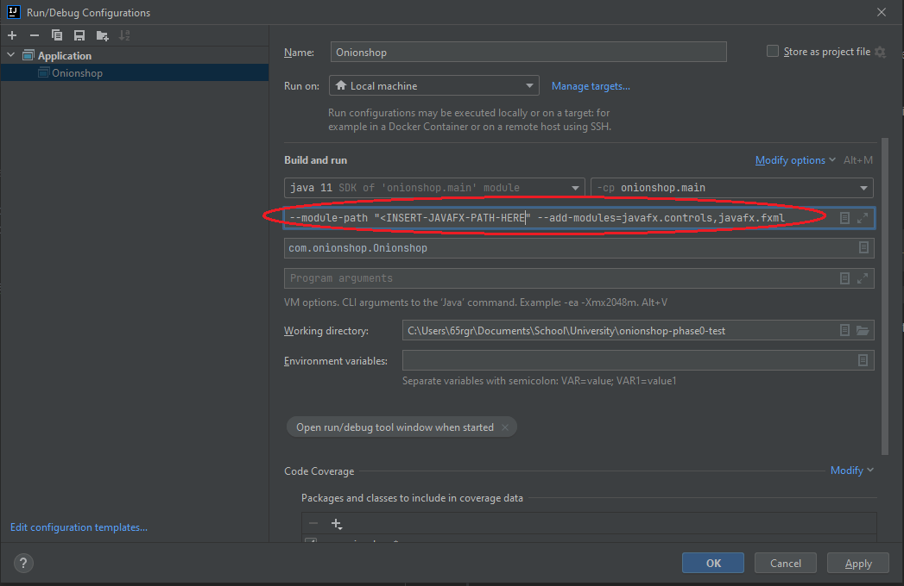
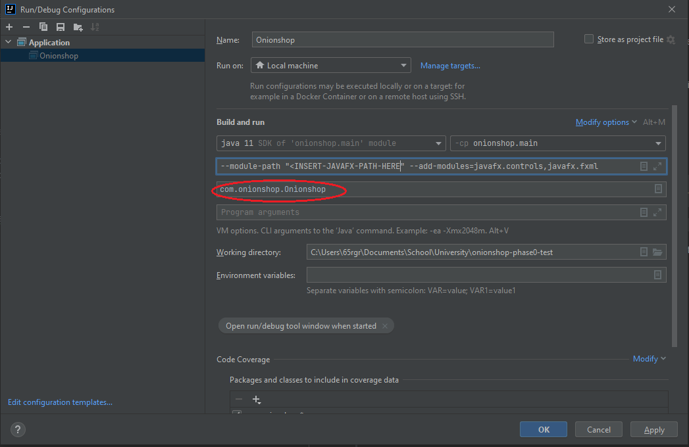

# The Onionshop

This is a directory for the project. Setup instructions are below the links section.

## Links

- [Phase 0](/phase0)

## How do I get started?

1) Clone the repository.

2) Visit https://gluonhq.com/products/javafx/ to download the appropriate version of the JavaFX SDK for your computer.

3) Click include older versions.

4) Download version 11.0.2.

5) Unzip the zipped file, and place the folder named `javafx-sdk-11.0.2` into your desired directory.

6) Open the project in IntelliJ.

7) Click the Run/Debug Configuration dropdown.

8) Click Edit Configurations.

9) Click Modify Options, and select Add VM options

10) In VM options, enter:

    `--module-path "<INSERT-JAVAFX-PATH-HERE>" --add-modules=javafx.controls,javafx.fxml`

Ensure you remove the `<` and `>`. Point the path into the lib folder inside `javafx-sdk-11.0.2`.

11) Ensure “com.onionshop.Onionshop” is entered in the “Main class” selector.

12) Leave program arguments blank.

13) Click apply, 

14) Navigate to Onionshop.java under “src\main\java\com\onionshop”.

15) Run “Onionshop.java”. 
