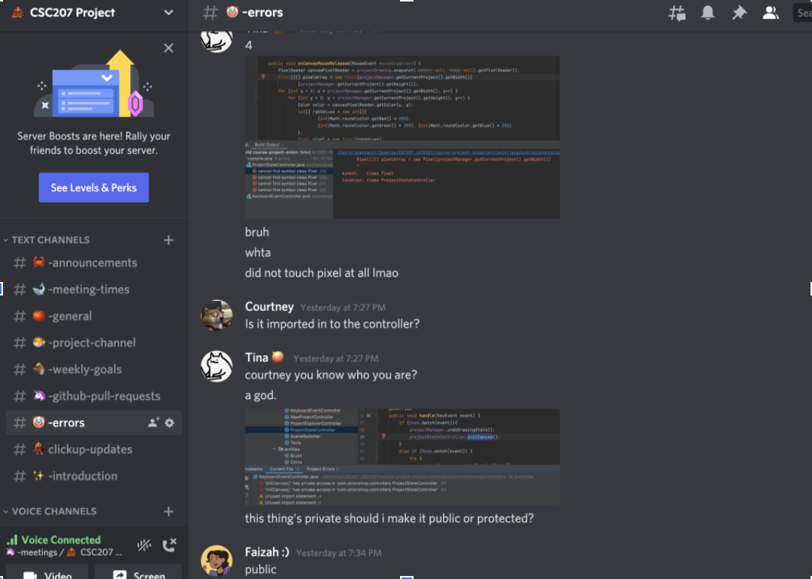

#Design Document

##UML Diagram

Below is a UML diagram representing the current program. It is seperated into Entities, Managers, Controllers, and the UI.

##Major Design Decisions

A description of any major design decisions your group has made (along with brief explanations of why you made them).

**_Most recent project_**
- We decided to serialize our most recent projects in a file called “fresh-onions.txt”. This is because, the directories of the users most recent projects is data that needs to be persisted over multiple sessions of using the application.
We created a new manager for most recent projects since that seemed to be a use case that is different from the ones we had previously
Decided not to create a MostRecentProject class for the time being since it would just be a class with storing two attributes: project name and directory, and no methods

_**Colour Palette**_
- Decided to make colour palette its own class to adhere to the Single Responsibility principle

_**Manager Classes**_ 
- Decided to make the ToolStateManager and the ProjectStateManager singleton classes so that they could be accessed across all controller and management classes

_**Shape Tool**_
- Used the template method when structuring the shape tool since it allows for customizable design and a standardized simple superclass which makes for a well structured framework suitable for the Shape -> (Line, Rectangle, Circle, etc.) but creates the object whenever it is called rather than having the object for the entire duration it is used. 
- Use a counter (drawStage) to count the stage of the shape tool and hence different draw actions according to it.

_**Undo Redo Manager**_
- Used Memento pattern, since the pattern seemed to be used specifically for undoing and redoing.

_**Keyboard Events**_
- Used dependency injection in order to call ProjectStateController methods when we ctrl Z and ctrl Y for undoing and redoing. Otherwise it did not seem possible to update the canvas from keyboard events 
- Added a method in scene switcher specifically for attaching the KeyBoardEventController to the main-canvas-view scene because of the way JavaFX requires us to add EventHandlers to scenes.

##Clean Architecture

### Scenario Walkthrough

Let’s take the scenario of starting the program, the user selecting a recently created Onion and drawing a line, to demonstrate an instance of clean architecture.

1) User will start the program and see the project explorer window open. 
   1) There is a tab titled “Fresh Onions” 
      1) This uses the ProjectExplorerController to generate a view with most recent projects, or more accurately, “Fresh Onions” 
      2) The ProjectExplorerController depends on the MostRecentProjectManager (a use case), which manages most recent projects 
      3) An array of most recent projects is returned and displayed in the window
2) User selects and opens a previously created project. 
   1) The user selects the top-most Onion, most recent project by moving their mouse and clicking on the project 
      1) The project is loaded with the projectManager, which uses the OnionFileLoader and a Project entity 
      2) The selected project is moved to the appropriate spot in a stack of most recent projects with MostRecentProjectManager
   2) The scene is switched with the ProjectStateController
3) User draws a line. 
   1) User selects the pen tool from the tool bar 
      1) Updates the currently selected tool in ToolStateManager (use case)
      2) ToolStateManager interacts with Tool and Colour entities
   2) User selects a colour by clicking the colour drop down, and selecting a colour from the default colours 
      1) JavaFX handles changing colours 
      2) Updates the currently selected colour in ToolStateManager 
      3) ToolStateManager interacts with Tool and Colour entities
   3) Drawing the actual line 
      1) Uses CanvasEvents to process data, which calls DrawingManager (use case) which uses the current tool (entity) and colour (entity) to draw on the Canvas

###Violations

One such violation of clear architecture is the Pixel class. It is an entity that is called by a controller, the ProjectStateController. 

###Dependency Rule

There are many instances of the dependency rule being explicitly followed. Let’s take the scenario of a user loading up the program and viewing a recent project.

The recent project window uses the ProjectExplorerController (a controller) to generate the scene in which various projects and the window is displayed. The scene is initialized, and an instance of the MostRecentProjectManager is created.

The MostRecentProjectManager is a use case which manages and controls most recent projects. It does this via a `.txt` file in the user’s documents folder which contains names for projects a user may have created and their corresponding directories.

There is no instance of the controller directly interacting with the `.txt` file. Everytime the controller needs to access recent projects, it goes through the manager, which calls upon the `.txt` file. The `.txt` file has no knowledge of the manager, and the manager has no knowledge of the controller.

##Solid Design Principles

_Single Responsibility Principle_

Each class in our program has its own purpose and there doesn’t seem to be much overlap in terms of their responsibilities. For example Project class is responsible for storing details about drawing projects made by the user, which can be later serialized into a .onion file. Each part of the project is a separate class as well, the drawing is represented by a 2D array of the Pixel class, and the ColourPallete is also a separate class. Thus, making the Project class less cluttered and ensures that its only responsibilities are to store project details, and serialize the data into an array of strings which can be saved into a file. The same can be said for the controllers, which are responsible for taking in events from the UI. Each of ProjectStateController, ProjectExplorer controller, and NewProjectController are responsible for their respective corresponding scenes with no overlap, and the KeyBoardEvents controller is responsible for keyboard input.

However, the DrawingManager and CanvasEvents may need some reconsidering when it comes to the SRP. Originally, the DrawingManager was responsible for taking the current tool state, and drawing on the pixels which were touched by the mouse accordingly. Currently, DrawingManager has also taken on the responsibility of adding and removing items from the colour palette. We think this is a result of how we set up CanvasEvents as a class which processes all the raw input data from the controller, and then calls DrawingManager methods with that process data. Maybe reversing the roles, and making individual classes such as ColourSelectionEvent, DrawEvent, ColourPaletteEvent, ToolSelectionEvent, which are then taken in by methods in DrawingManager, ProjectManager and ToolStateManager might be a way to ensure each class has a well defined responsibility. We can consider refactoring into this structure for Phase 2. Feedback on this would be appreciated.

_Open/Closed Principle_

Adding a new tool to our program wouldn’t require much refactoring since the structure of inheritance for children of the Tool class adheres to the OCP. We just need to ensure that the new tool implements the Tool interface. If the tool has similar functionality to either Shape or Brush, then it can extend either of those abstract classes. Furthermore, any type of class that centers around storing an RGB value can extend Pixel. For instance, the Colour class extends Pixel.

CanvasEvents seems to violate the OCP, since if we need to process any raw input data that hasn’t been covered by CanvasEvents, we would need to add that method to CanvasEvents, rather than creating a new class. The managers in general also seem to require adding to the existing manager rather than extending the manager to add the new functionality. We aren’t sure how to fix this in our design or if it's necessary, since it seems to make sense to add to ProjectManager for features that require access to the current project. Especially since it is a singleton that is storing state.

_Liskov Substitution Principle_

We currently only have an inheritance relationship between the tools as well as Pixel and Colour. Since Tool is an interface, and Brush and Shape are abstract classes, we can only instantiate the concrete implementations of those classes. Eraser and Pen are interchangeable with each other, and either can be used for the type Brush or Tool. The same can be said for each implementation of Shape. Furthermore, it is possible for us to replace Pixel everywhere in our code with Colour, which means it adheres to LSP. It just is not necessary since the main difference between Pixel and Colour is that Colour has a name, whereas Pixel doesn’t, which isn’t necessary for the majority of our uses of Pixel.

_Interface Segregation Principle_

The Tool interface has only two methods inside it, which are draw and calculateEffectedPixel. They are common methods that each tool needs to implement. It is intentionally kept short so that the classes implementing it won’t be forced to implement irrelevant methods. For example, shape, brush, pen, circle, rectangle, line and eraser are all either directly implementing the Tool interface, or have a parent (shape) that implements the Tool interface. The individual classes are very much different in terms of functionality. Instances of shape like circle and rectangle creates shapes on the canvas while line draws a line from starting point to an ending point. Brush would have methods like setBrushSize and setBrushShape that adjusts the attributes of a brush, and line class has method calculateSlope and lineCalculationFormula that are used to perform calculations of lines. These methods only make sense in their own context, it wouldn’t make sense if the Tool interface had setBrsuhSize method because not every tool has a size. Considering that, we kept the Tool interface small so that when someone wants to develop a new tool, he wouldn’t end up depending on things he doesn't need.

_Dependency inversion principle_

High level modules (controllers) do not depend on low-level modules(entities). In our program the controllers are dependent on the use cases instead. For example, ProjectStateController uses ToolStateManager and DrawingManager to initialize the canvas as well as updating it when the user draws a stroke on canvas. KeyboardEventController uses the current ProjectManager to achieve the undo-redo feature. In addition, ProjectExplorerController depends on MostRecentProjectManager to display and label the most recent projects edited. In each example the controller did not instantiate any entity directly, instead just initialized use cases that did the job. This extra layer between the high-level classes and low-level classes preserved flexibility in the way that if an entity needs to be replaced, the logic in controllers does not need to change accordingly.

##Packaging Strategies

The only packaging strategy we have seriously considered is the “By Layer” packaging strategy as that makes the most sense regarding the purpose of our project and how it is designed. Although we have looked into the component class, the entirety of our project is all extremely dependent on the system rather than various modules that would rather benefit from being in a different package. As a result, ever since we have established the structure of our project, it is obvious to us to use the By Layer packaging strategy over anything else.

The By Layer Packaging Strategy is as intuitive as it sounds – it divides the packages by the layers of Clean Architecture of Frameworks & Drivers, Interface Adapters, Application Business Rules, and Enterprises Business Rules. In the case of our application it would be the Onionshop as the user interface, then each Controllers, Events, Managers, and Entities. This provides us with an incredibly clear and easy-to-work-with framework as every layer of our application interacts and relates as a whole rather than working as individual unrelated components. Starting from the entities, the design of the working of the interface and abstract classes leave us many classes which will benefit from being grouped together as a few managers are directly working with multiples of the entities which also interact with the events which then work with certain controllers that control and interact with the front end.

##Design Patterns

_Memento_

We used the Memento Design pattern to implement one of our features, the Undo-Redo Manager. For this feature, we implemented 3 classes: The Caretaker as the UndoRedoManager class, the Memento as the DrawingState class, and the Originator as the ProjectManager class. Every time the user finishes drawing a stroke, our controller tells our ProjectManager class to create a copy of the current canvas as a DrawingState and to send that copy to the UndoRedoManager to be stored. Then, when the user presses ctrl z, this tells the projectManager to have the UndoRedoManager roll back a state (by popping the state off of the top of the stack of saved undo Mementos and adding it to the redo stack) and set the current project DrawingState to this last Memento. The user can then also redo the stroke by pressing ctrl y, which has the ProjectManager retrieve the last DrawingState on top of the redo stack and sets the current DrawingState to this memento. This DrawingState is popped off the redo stack and added back to the undo stack.

Pull Request: https://github.com/CSC207-UofT/course-project-onion/pull/67

_Template Method_

We used the Template Methods to implement the drawing Tools in our program. The Tool interface acts as our template, containing two abstract methods that all Tools must implement: the draw method and the calculateEffectedPixels method. The draw method takes in coordinates on the canvas and edits the pixels based on those coordinates. The calculateEffectedPixels method calculates the pixels around the cursor that would be edited based on the current Tool’s size.

Pull Requests:
https://github.com/CSC207-UofT/course-project-onion/pull/6
https://github.com/CSC207-UofT/course-project-onion/pull/62

_Dependency injection_

We used Dependency Injection in our project in several areas. One area where we used this was in the KeyBoardEventController, where the ProjectStateController is constructed outside the KeyBoardEventController and is passed into the class via it’s constructor. Another area was in CanvasEvents, where the DrawingManager is constructed separately and passed in via the classes constructor.

Pull Requests:
https://github.com/CSC207-UofT/course-project-onion/pull/76

##Testing

There were a few classes that we decided not to test.

_Controllers_
- JavaFX classes are already unit tested, and we are unit testing our uses cases and entities so it didn’t seem necessary to test these 
- We also weren’t sure how to test these since they rely on UI events

_Project Manager_
- Most methods in this class just call methods from OnionFileLoader 
- We will test ProjectManager.updateDrawingCanvas in Phase 2 (we ran into some issues in implementing the Undo Redo system, so what this method will do may change)

_DrawingState and NewProjectEvent_
- These classes only contain getters

##Refactoring

We refactored the entire project into our packaging system.
- https://github.com/CSC207-UofT/course-project-onion/pull/43

We refactored code in OnionFileLoader to be in separate smaller methods.
- https://github.com/CSC207-UofT/course-project-onion/pull/39 

##Dealing with Errors

Our group used discord for all of our communication. We decided that it would be easiest to just add a channel to our server dedicated to errors, since most of us are quite active on the platform so we would get quicker responses from each other. 

